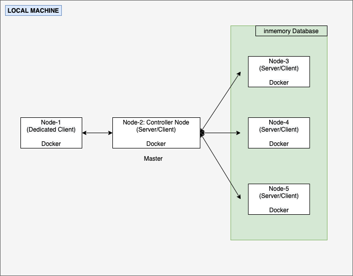

### Unacademy assignment: Distributed Key-Value Store

## OVERVIEW
A key-value store is a database that stores some value against a given key. The database can be queried using a key to retrieve the value. The block diagram shown above is a in-memory distributed key-value store.

In this assignment, I have setup a 5 node cluster using docker conatiner. Out of which 3 nodes are dedicated for database, 1 is used as master which routs the data based on consistent hasing pinciple and the remaining 1 node acts as dedicated client.
Any database nodes or master node can also be used as client. 

Request coming from client 1st goes to master. The master then routs the data to database based on the database node ip returned from the consistent hashing function. For internode communication, I have used socket programming(client server).

## Functionality
* Users can connect to the database over the network.
* Users can GET/SET a key.
* Users can EXPIRE (auto-delete after a given duration) a key.
* Users can connect to any node to SET a key, and connect to any other node to GET the key.
* Multiple users can concurrently use the database.
* The database is fully functional even if one node goes down.
## SPECIFICATIONS
* The command format for GET, SET and EXPIRE operations is same as that used by Redis.
* The client have a persistent connection to the database through any of its nodes.
* The data is persisted inmemory, though the data can be stored in disk with a little tweak.
* Out of 5 nodes in the cluster, 3 nodes are dedicate to database. Any of the database node can go down without hampering the database functionality.
* All nodes will be running on the same machine. 
* Once a node goes down, it can comeup again but the data will be lost. It will start saving new incoming data.
* The solution is implemented in python. 
* Users can store more data into the database by increasing the number of nodes.

## Files and description
```
unacademy_aman_assignment
|-- client.py : Client job that acts as sending query
|-- config.cfg: stored the ip information of dataabse nodes
|-- Dockerfile: Docker image file for client and master node
|-- Dockerfile_database_node: Docker file for databse node
|-- master.py: Master job that holds data routing rules
```

## Steps to start the cluster
[Install Docker](https://docs.docker.com/v17.12/docker-for-mac/install/)
#### Build Docker Image
Go to UN directory: `cd UN`

Build: `$docker build -t unacademy .`
```
Sending build context to Docker daemon  54.78kB
Step 1/8 : FROM python:latest
 ---> d6f5dddc84ee
Step 2/8 : COPY client.py /
 ---> f8fe92c0c01e
Step 3/8 : COPY config.cfg /
 ---> 8b64819c291b
Step 4/8 : COPY master.py /
 ---> 01f34a7dc355
Step 5/8 : RUN apt-get update
 ---> Running in a9b1b080f196
Get:1 http://security.debian.org/debian-security buster/updates InRelease [65.4 kB]
Get:2 http://deb.debian.org/debian buster InRelease [121 kB]
Get:3 http://security.debian.org/debian-security buster/updates/main amd64 Packages [272 kB]
Get:4 http://deb.debian.org/debian buster-updates InRelease [51.9 kB]
Get:5 http://deb.debian.org/debian buster/main amd64 Packages [7907 kB]
Get:6 http://deb.debian.org/debian buster-updates/main amd64 Packages [9504 B]
Fetched 8427 kB in 13s (649 kB/s)
Reading package lists...
Removing intermediate container a9b1b080f196
 ---> fe6aa5da09f6
Step 6/8 : RUN apt upgrade -y
 ---> Running in c4a096fd4e5e

WARNING: apt does not have a stable CLI interface. Use with caution in scripts.

Reading package lists...
Building dependency tree...
Reading state information...
Calculating upgrade...
The following packages will be upgraded:
  curl libcurl3-gnutls libcurl4 libcurl4-openssl-dev libopenjp2-7
  libopenjp2-7-dev
6 upgraded, 0 newly installed, 0 to remove and 0 not upgraded.
Need to get 1550 kB of archives.
After this operation, 8192 B of additional disk space will be used.
Get:1 http://security.debian.org/debian-security buster/updates/main amd64 libcurl4-openssl-dev amd64 7.64.0-4+deb10u2 [420 kB]
Get:2 http://security.debian.org/debian-security buster/updates/main amd64 curl amd64 7.64.0-4+deb10u2 [265 kB]
Get:3 http://security.debian.org/debian-security buster/updates/main amd64 libcurl4 amd64 7.64.0-4+deb10u2 [332 kB]
Get:4 http://security.debian.org/debian-security buster/updates/main amd64 libcurl3-gnutls amd64 7.64.0-4+deb10u2 [330 kB]
Get:5 http://security.debian.org/debian-security buster/updates/main amd64 libopenjp2-7-dev amd64 2.3.0-2+deb10u2 [44.4 kB]
Get:6 http://security.debian.org/debian-security buster/updates/main amd64 libopenjp2-7 amd64 2.3.0-2+deb10u2 [158 kB]
debconf: delaying package configuration, since apt-utils is not installed
Fetched 1550 kB in 1s (1398 kB/s)
(Reading database ... 24611 files and directories currently installed.)
Preparing to unpack .../0-libcurl4-openssl-dev_7.64.0-4+deb10u2_amd64.deb ...
Unpacking libcurl4-openssl-dev:amd64 (7.64.0-4+deb10u2) over (7.64.0-4+deb10u1) ...
Preparing to unpack .../1-curl_7.64.0-4+deb10u2_amd64.deb ...
Unpacking curl (7.64.0-4+deb10u2) over (7.64.0-4+deb10u1) ...
Preparing to unpack .../2-libcurl4_7.64.0-4+deb10u2_amd64.deb ...
Unpacking libcurl4:amd64 (7.64.0-4+deb10u2) over (7.64.0-4+deb10u1) ...
Preparing to unpack .../3-libcurl3-gnutls_7.64.0-4+deb10u2_amd64.deb ...
Unpacking libcurl3-gnutls:amd64 (7.64.0-4+deb10u2) over (7.64.0-4+deb10u1) ...
Preparing to unpack .../4-libopenjp2-7-dev_2.3.0-2+deb10u2_amd64.deb ...
Unpacking libopenjp2-7-dev (2.3.0-2+deb10u2) over (2.3.0-2+deb10u1) ...
Preparing to unpack .../5-libopenjp2-7_2.3.0-2+deb10u2_amd64.deb ...
Unpacking libopenjp2-7:amd64 (2.3.0-2+deb10u2) over (2.3.0-2+deb10u1) ...
Setting up libcurl3-gnutls:amd64 (7.64.0-4+deb10u2) ...
Setting up libcurl4:amd64 (7.64.0-4+deb10u2) ...
Setting up libopenjp2-7:amd64 (2.3.0-2+deb10u2) ...
Setting up curl (7.64.0-4+deb10u2) ...
Setting up libopenjp2-7-dev (2.3.0-2+deb10u2) ...
Setting up libcurl4-openssl-dev:amd64 (7.64.0-4+deb10u2) ...
Processing triggers for libc-bin (2.28-10) ...
Removing intermediate container c4a096fd4e5e
 ---> d7975281ded0
Step 7/8 : RUN apt install -y vim
 ---> Running in 80567746217f

WARNING: apt does not have a stable CLI interface. Use with caution in scripts.

Reading package lists...
Building dependency tree...
Reading state information...
The following additional packages will be installed:
  libgpm2 vim-common vim-runtime xxd
Suggested packages:
  gpm ctags vim-doc vim-scripts
The following NEW packages will be installed:
  libgpm2 vim vim-common vim-runtime xxd
0 upgraded, 5 newly installed, 0 to remove and 0 not upgraded.
Need to get 7425 kB of archives.
After this operation, 33.8 MB of additional disk space will be used.
Get:1 http://deb.debian.org/debian buster/main amd64 xxd amd64 2:8.1.0875-5 [140 kB]
Get:2 http://deb.debian.org/debian buster/main amd64 vim-common all 2:8.1.0875-5 [195 kB]
Get:3 http://deb.debian.org/debian buster/main amd64 libgpm2 amd64 1.20.7-5 [35.1 kB]
Get:4 http://deb.debian.org/debian buster/main amd64 vim-runtime all 2:8.1.0875-5 [5775 kB]
Get:5 http://deb.debian.org/debian buster/main amd64 vim amd64 2:8.1.0875-5 [1280 kB]
debconf: delaying package configuration, since apt-utils is not installed
Fetched 7425 kB in 5s (1466 kB/s)
Selecting previously unselected package xxd.
(Reading database ... 24611 files and directories currently installed.)
Preparing to unpack .../xxd_2%3a8.1.0875-5_amd64.deb ...
Unpacking xxd (2:8.1.0875-5) ...
Selecting previously unselected package vim-common.
Preparing to unpack .../vim-common_2%3a8.1.0875-5_all.deb ...
Unpacking vim-common (2:8.1.0875-5) ...
Selecting previously unselected package libgpm2:amd64.
Preparing to unpack .../libgpm2_1.20.7-5_amd64.deb ...
Unpacking libgpm2:amd64 (1.20.7-5) ...
Selecting previously unselected package vim-runtime.
Preparing to unpack .../vim-runtime_2%3a8.1.0875-5_all.deb ...
Adding 'diversion of /usr/share/vim/vim81/doc/help.txt to /usr/share/vim/vim81/doc/help.txt.vim-tiny by vim-runtime'
Adding 'diversion of /usr/share/vim/vim81/doc/tags to /usr/share/vim/vim81/doc/tags.vim-tiny by vim-runtime'
Unpacking vim-runtime (2:8.1.0875-5) ...
Selecting previously unselected package vim.
Preparing to unpack .../vim_2%3a8.1.0875-5_amd64.deb ...
Unpacking vim (2:8.1.0875-5) ...
Setting up libgpm2:amd64 (1.20.7-5) ...
Setting up xxd (2:8.1.0875-5) ...
Setting up vim-common (2:8.1.0875-5) ...
Setting up vim-runtime (2:8.1.0875-5) ...
Setting up vim (2:8.1.0875-5) ...
update-alternatives: using /usr/bin/vim.basic to provide /usr/bin/vim (vim) in auto mode
update-alternatives: using /usr/bin/vim.basic to provide /usr/bin/vimdiff (vimdiff) in auto mode
update-alternatives: using /usr/bin/vim.basic to provide /usr/bin/rvim (rvim) in auto mode
update-alternatives: using /usr/bin/vim.basic to provide /usr/bin/rview (rview) in auto mode
update-alternatives: using /usr/bin/vim.basic to provide /usr/bin/vi (vi) in auto mode
update-alternatives: using /usr/bin/vim.basic to provide /usr/bin/view (view) in auto mode
update-alternatives: using /usr/bin/vim.basic to provide /usr/bin/ex (ex) in auto mode
update-alternatives: using /usr/bin/vim.basic to provide /usr/bin/editor (editor) in auto mode
Processing triggers for hicolor-icon-theme (0.17-2) ...
Processing triggers for libc-bin (2.28-10) ...
Processing triggers for mime-support (3.62) ...
Removing intermediate container 80567746217f
 ---> bf95f7a48258
Step 8/8 : RUN apt install -y iputils-ping
 ---> Running in 0ef905615ea0

WARNING: apt does not have a stable CLI interface. Use with caution in scripts.

Reading package lists...
Building dependency tree...
Reading state information...
iputils-ping is already the newest version (3:20180629-2+deb10u2).
0 upgraded, 0 newly installed, 0 to remove and 0 not upgraded.
Removing intermediate container 0ef905615ea0
 ---> 83c1ca40d0d5
Successfully built 83c1ca40d0d5
Successfully tagged unacademy:latest
```
Check image: `$docker images`
```
REPOSITORY          TAG                 IMAGE ID            CREATED             SIZE
unacademy           latest              ab642e9d73ab        24 seconds ago      885MB
```

Build: `docker build -f Dockerfile_database_node -t unacademy:database .`
```
Sending build context to Docker daemon  54.78kB
Step 1/8 : FROM python:latest
 ---> d6f5dddc84ee
Step 2/8 : COPY database.py /
 ---> Using cache
 ---> d653264540b1
Step 3/8 : COPY client.py /
 ---> Using cache
 ---> b884d7de4afa
Step 4/8 : RUN apt-get update
 ---> Running in 20d9fd57f3eb
Get:1 http://deb.debian.org/debian buster InRelease [121 kB]
Get:2 http://security.debian.org/debian-security buster/updates InRelease [65.4 kB]
Get:3 http://security.debian.org/debian-security buster/updates/main amd64 Packages [272 kB]
Get:4 http://deb.debian.org/debian buster-updates InRelease [51.9 kB]
Get:5 http://deb.debian.org/debian buster/main amd64 Packages [7907 kB]
Get:6 http://deb.debian.org/debian buster-updates/main amd64 Packages [9504 B]
Fetched 8427 kB in 17s (509 kB/s)
Reading package lists...
Removing intermediate container 20d9fd57f3eb
 ---> b9723099a82f
Step 5/8 : RUN apt upgrade -y
 ---> Running in 80ec86633f44

WARNING: apt does not have a stable CLI interface. Use with caution in scripts.

Reading package lists...
Building dependency tree...
Reading state information...
Calculating upgrade...
The following packages will be upgraded:
  curl libcurl3-gnutls libcurl4 libcurl4-openssl-dev libopenjp2-7
  libopenjp2-7-dev
6 upgraded, 0 newly installed, 0 to remove and 0 not upgraded.
Need to get 1550 kB of archives.
After this operation, 8192 B of additional disk space will be used.
Get:1 http://security.debian.org/debian-security buster/updates/main amd64 libcurl4-openssl-dev amd64 7.64.0-4+deb10u2 [420 kB]
Get:2 http://security.debian.org/debian-security buster/updates/main amd64 curl amd64 7.64.0-4+deb10u2 [265 kB]
Get:3 http://security.debian.org/debian-security buster/updates/main amd64 libcurl4 amd64 7.64.0-4+deb10u2 [332 kB]
Get:4 http://security.debian.org/debian-security buster/updates/main amd64 libcurl3-gnutls amd64 7.64.0-4+deb10u2 [330 kB]
Get:5 http://security.debian.org/debian-security buster/updates/main amd64 libopenjp2-7-dev amd64 2.3.0-2+deb10u2 [44.4 kB]
Get:6 http://security.debian.org/debian-security buster/updates/main amd64 libopenjp2-7 amd64 2.3.0-2+deb10u2 [158 kB]
debconf: delaying package configuration, since apt-utils is not installed
Fetched 1550 kB in 2s (626 kB/s)
(Reading database ... 24611 files and directories currently installed.)
Preparing to unpack .../0-libcurl4-openssl-dev_7.64.0-4+deb10u2_amd64.deb ...
Unpacking libcurl4-openssl-dev:amd64 (7.64.0-4+deb10u2) over (7.64.0-4+deb10u1) ...
Preparing to unpack .../1-curl_7.64.0-4+deb10u2_amd64.deb ...
Unpacking curl (7.64.0-4+deb10u2) over (7.64.0-4+deb10u1) ...
Preparing to unpack .../2-libcurl4_7.64.0-4+deb10u2_amd64.deb ...
Unpacking libcurl4:amd64 (7.64.0-4+deb10u2) over (7.64.0-4+deb10u1) ...
Preparing to unpack .../3-libcurl3-gnutls_7.64.0-4+deb10u2_amd64.deb ...
Unpacking libcurl3-gnutls:amd64 (7.64.0-4+deb10u2) over (7.64.0-4+deb10u1) ...
Preparing to unpack .../4-libopenjp2-7-dev_2.3.0-2+deb10u2_amd64.deb ...
Unpacking libopenjp2-7-dev (2.3.0-2+deb10u2) over (2.3.0-2+deb10u1) ...
Preparing to unpack .../5-libopenjp2-7_2.3.0-2+deb10u2_amd64.deb ...
Unpacking libopenjp2-7:amd64 (2.3.0-2+deb10u2) over (2.3.0-2+deb10u1) ...
Setting up libcurl3-gnutls:amd64 (7.64.0-4+deb10u2) ...
Setting up libcurl4:amd64 (7.64.0-4+deb10u2) ...
Setting up libopenjp2-7:amd64 (2.3.0-2+deb10u2) ...
Setting up curl (7.64.0-4+deb10u2) ...
Setting up libopenjp2-7-dev (2.3.0-2+deb10u2) ...
Setting up libcurl4-openssl-dev:amd64 (7.64.0-4+deb10u2) ...
Processing triggers for libc-bin (2.28-10) ...
Removing intermediate container 80ec86633f44
 ---> d251dffabbe9
Step 6/8 : RUN apt install -y vim
 ---> Running in 8efa089d4984

WARNING: apt does not have a stable CLI interface. Use with caution in scripts.

Reading package lists...
Building dependency tree...
Reading state information...
The following additional packages will be installed:
  libgpm2 vim-common vim-runtime xxd
Suggested packages:
  gpm ctags vim-doc vim-scripts
The following NEW packages will be installed:
  libgpm2 vim vim-common vim-runtime xxd
0 upgraded, 5 newly installed, 0 to remove and 0 not upgraded.
Need to get 7425 kB of archives.
After this operation, 33.8 MB of additional disk space will be used.
Get:1 http://deb.debian.org/debian buster/main amd64 xxd amd64 2:8.1.0875-5 [140 kB]
Get:2 http://deb.debian.org/debian buster/main amd64 vim-common all 2:8.1.0875-5 [195 kB]
Get:3 http://deb.debian.org/debian buster/main amd64 libgpm2 amd64 1.20.7-5 [35.1 kB]
Get:4 http://deb.debian.org/debian buster/main amd64 vim-runtime all 2:8.1.0875-5 [5775 kB]
Get:5 http://deb.debian.org/debian buster/main amd64 vim amd64 2:8.1.0875-5 [1280 kB]
debconf: delaying package configuration, since apt-utils is not installed
Fetched 7425 kB in 7s (1133 kB/s)
Selecting previously unselected package xxd.
(Reading database ... 24611 files and directories currently installed.)
Preparing to unpack .../xxd_2%3a8.1.0875-5_amd64.deb ...
Unpacking xxd (2:8.1.0875-5) ...
Selecting previously unselected package vim-common.
Preparing to unpack .../vim-common_2%3a8.1.0875-5_all.deb ...
Unpacking vim-common (2:8.1.0875-5) ...
Selecting previously unselected package libgpm2:amd64.
Preparing to unpack .../libgpm2_1.20.7-5_amd64.deb ...
Unpacking libgpm2:amd64 (1.20.7-5) ...
Selecting previously unselected package vim-runtime.
Preparing to unpack .../vim-runtime_2%3a8.1.0875-5_all.deb ...
Adding 'diversion of /usr/share/vim/vim81/doc/help.txt to /usr/share/vim/vim81/doc/help.txt.vim-tiny by vim-runtime'
Adding 'diversion of /usr/share/vim/vim81/doc/tags to /usr/share/vim/vim81/doc/tags.vim-tiny by vim-runtime'
Unpacking vim-runtime (2:8.1.0875-5) ...
Selecting previously unselected package vim.
Preparing to unpack .../vim_2%3a8.1.0875-5_amd64.deb ...
Unpacking vim (2:8.1.0875-5) ...
Setting up libgpm2:amd64 (1.20.7-5) ...
Setting up xxd (2:8.1.0875-5) ...
Setting up vim-common (2:8.1.0875-5) ...
Setting up vim-runtime (2:8.1.0875-5) ...
Setting up vim (2:8.1.0875-5) ...
update-alternatives: using /usr/bin/vim.basic to provide /usr/bin/vim (vim) in auto mode
update-alternatives: using /usr/bin/vim.basic to provide /usr/bin/vimdiff (vimdiff) in auto mode
update-alternatives: using /usr/bin/vim.basic to provide /usr/bin/rvim (rvim) in auto mode
update-alternatives: using /usr/bin/vim.basic to provide /usr/bin/rview (rview) in auto mode
update-alternatives: using /usr/bin/vim.basic to provide /usr/bin/vi (vi) in auto mode
update-alternatives: using /usr/bin/vim.basic to provide /usr/bin/view (view) in auto mode
update-alternatives: using /usr/bin/vim.basic to provide /usr/bin/ex (ex) in auto mode
update-alternatives: using /usr/bin/vim.basic to provide /usr/bin/editor (editor) in auto mode
Processing triggers for hicolor-icon-theme (0.17-2) ...
Processing triggers for libc-bin (2.28-10) ...
Processing triggers for mime-support (3.62) ...
Removing intermediate container 8efa089d4984
 ---> 11a4a46c5833
Step 7/8 : RUN apt install -y iputils-ping
 ---> Running in 8b6f58aecdb4

WARNING: apt does not have a stable CLI interface. Use with caution in scripts.

Reading package lists...
Building dependency tree...
Reading state information...
iputils-ping is already the newest version (3:20180629-2+deb10u2).
0 upgraded, 0 newly installed, 0 to remove and 0 not upgraded.
Removing intermediate container 8b6f58aecdb4
 ---> 9bf94f0b322e
Step 8/8 : CMD python3 database.py
 ---> Running in f167df978e2b
Removing intermediate container f167df978e2b
 ---> 379ac57c7c84
Successfully built 379ac57c7c84
Successfully tagged unacademy:database
```
Check image: `$docker images`
```
REPOSITORY          TAG                 IMAGE ID            CREATED             SIZE
unacademy           database            379ac57c7c84        4 minutes ago       944MB
unacademy           latest              83c1ca40d0d5        5 minutes ago       944MB
```

Run Docker Container for database-node-1: `$docker run -it  --name database-node-1  -d unacademy:database`
```
18fadbb83ff2c6ea98156dba47a05610265f7d6e601b5736ccf1eb1be8c80a2d
```
Run Docker Container for database-node-2: `$docker run -it  --name database-node-2  -d unacademy:database`
```
34f168a95994d80faf7789665fba2db7cf557077da61408bfe6b937553398008
```
Run Docker Container for database-node-3: `$docker run -it  --name database-node-3  -d unacademy:database`
```
34f168a95995736ccf1eb1be8c80a2dcf557077da61408bfe6b9375533980434
```
Check running container: `$docker run ps`
```
CONTAINER ID        IMAGE                COMMAND                  CREATED             STATUS              PORTS               NAMES
34f168a95994        unacademy:database   "/bin/sh -c 'python3…"   4 seconds ago       Up 3 seconds                            database-node-3
8e046210447f        unacademy:database   "/bin/sh -c 'python3…"   12 seconds ago      Up 11 seconds                           database-node-2
f4d177e75ecb        unacademy:database   "/bin/sh -c 'python3…"   21 seconds ago      Up 20 seconds                           database-node-1
```
Get IP for database-node-1: `$docker inspect f4d177e75ecb | grep "IPAddress"`
```
"SecondaryIPAddresses": null,
"IPAddress": "172.17.0.2",
        "IPAddress": "172.17.0.2",
```
Get IP for database-node-2: `$docker inspect 8e046210447f | grep "IPAddress"`
```
"SecondaryIPAddresses": null,
"IPAddress": "172.17.0.3",
        "IPAddress": "172.17.0.3",
```
Get IP for database-node-3: `$docker inspect 34f168a95994 | grep "IPAddress"`
```
"SecondaryIPAddresses": null,
"IPAddress": "172.17.0.4",
        "IPAddress": "172.17.0.4",
```

Run Docker Container for master: `$docker run -it  --name master  -d unacademy:latest`
```
264b2a1ac141e93242cab2af929ea9daeaef4e7175fc110828abfba318700cdf
```
Get master container ID: `$docker ps | grep master`
```
264b2a1ac141 <- Container ID        unacademy:latest     "python3"                About a minute ago   Up About a minute                       master
```
Get inside the master container: `$docker exec -it 264b2a1ac141 bash` The `;` is comment.
```
root@264b2a1ac141:/# cat config.cfg 
[DATABASE-NODE-IP]
;database-node-1=172.17.0.7
;database-node-2=172.17.0.8
database-node-3=172.17.0.9
```
Edit config.cfg file with the IP addresses from database-nodes: `vim config.cfg`
```
[DATABASE-NODE-IP]
database-node-1=172.17.0.2
database-node-2=172.17.0.3
database-node-3=172.17.0.4
```
Run master job: `python3 master.py`
```
root@264b2a1ac141:/# python3 master.py 
12/04/2021 04:53:29 ++ WAITING FOR CONNECTIONS
```
Run Docker Container for client: `$docker run -it  --name client  -d unacademy:latest`
```
2e5330217ac9966d1f5801f2cc6d02d347950062dbcbb489ff5efff281aad54d
```
Get master container ID: `$docker ps | grep client`
```
2e5330217ac9        unacademy:latest     "python3"                48 seconds ago      Up 47 seconds                           client
```
Get inside the master container: `$docker exec -it 2e5330217ac9 bash`
```
root@2e5330217ac9:/# ls 
bin  boot  client.py  config.cfg  dev  etc  home  lib  lib64  master.py  media	mnt  opt  proc	root  run  sbin  srv  sys  tmp	usr  var
```
Check master node IP address: `docker inspect 264b2a1ac141 | grep "IPAddress"`
```
"SecondaryIPAddresses": null,
"IPAddress": "172.17.0.5",
        "IPAddress": "172.17.0.5",
```
Replace this address in client.py file: `vim client.py`
```
#!/usr/bin/env python3
import socket

HOST = '172.17.0.5'  # The server's hostname or IP address
PORT = 65431        # The port used by the server

.
.
```
Run client job: `python3 client.py`
```
unacademy[aman.db]>> 
```

Now our complete custer is up and running. As of now the cluster has 3 database nodes, 1 master node and 1 client node.

To create one another client in any of the already running node(database node):
```
$ docker exec -it <any-database-container-id> bash
#change the IPAddress of the master in client.py and run python client.py
```

## Database functionality
#### SET Operation
`SET [Key] [Value]`

It also accepts `set` or `Set`
#### GET Operation
`GET [Key]`

It also accepts `get` or `Get`
#### EXPIRE operation 
`EXPIRE [Key] [TTL in seconds]`

It also accepts `expire` or `Expire`
```
unacademy[aman.db]>> set horse 4
OK
unacademy[aman.db]>> get horse
4
unacademy[aman.db]>> expire horse 20
OK
unacademy[aman.db]>> GET horse
4 | TTL: 13 seconds
unacademy[aman.db]>> Get horse            
4 | TTL: 3 seconds
unacademy[aman.db]>> get horse
0
unacademy[aman.db]>> set man 2
OK
unacademy[aman.db]>> set man 5
Can't Override
unacademy[aman.db]>> expire man 15
OK
unacademy[aman.db]>> get man
2 | TTL: 13 seconds
unacademy[aman.db]>> set man 10
Can't Override
unacademy[aman.db]>> get man   
2 | TTL: 2 seconds
unacademy[aman.db]>> get man
0
unacademy[aman.db]>> set man 10
OK
unacademy[aman.db]>> 
```
Note: key and value sould be non space separated. I can implemet space separated key and value if asked.
## Other important Docker commands

Stop and Restart a container
```
$docker stop <container-id>
$docker start <container-id>
$docker exec -it <container_id> bash
```

Delete container: `$ docker container rm <container-id>`

Remove image: `docker rmi unacademy`

Remove specefic stopped conatiner: `docker container rm <container-id>`

Remove all stopped conatiner: `docker container prune`
